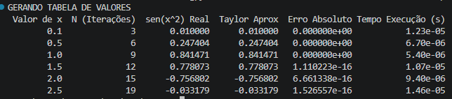
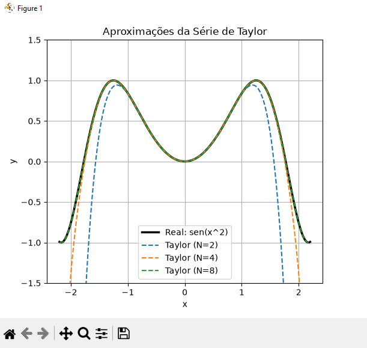
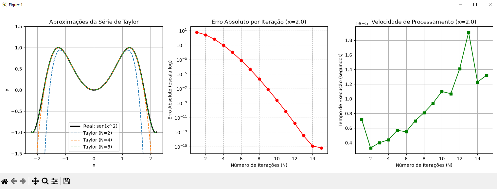

# EP1 - Cálculo da Série de Taylor para $y = \sin(x^2)$

**Disciplina:** Projeto Integrador: Computação Científica.
**Integrantes:** Gustavo Souza Freitas, Miguel Hakira Mendes Kato, Gabriel Martins.

Este repositório contém a implementação algorítmica e a fundamentação teórica para a aproximação da função $y = \sin(x^2)$ através do desenvolvimento em Série de Taylor (Maclaurin), otimizado para complexidade linear $O(N)$.

---

## 📘 Fundamentação Teórica

### 1. Dedução da Série por Substituição Algébrica
A Série de Maclaurin (Série de Taylor centrada em $a = 0$) para a função fundamental $\sin(u)$ é definida para todo $u \in \mathbb{R}$ como:

$$\sin(u) = \sum_{n=0}^{\infty} \frac{(-1)^n u^{2n+1}}{(2n+1)!} = u - \frac{u^3}{3!} + \frac{u^5}{5!} - \frac{u^7}{7!} + \dots$$

Para determinar a expansão da função-alvo $y = \sin(x^2)$, realiza-se a substituição direta da variável composta $u = x^2$ na série original. Esta técnica preserva a validade do domínio e otimiza a obtenção do polinômio sem a necessidade de calcular as sucessivas derivadas de alta ordem de $\sin(x^2)$ pela regra da cadeia.

Substituindo $u = x^2$:

$$\sin(x^2) = \sum_{n=0}^{\infty} \frac{(-1)^n (x^2)^{2n+1}}{(2n+1)!}$$

Aplicando as propriedades de potenciação $(x^2)^{2n+1} = x^{4n+2}$, obtemos a **Fórmula do Termo Geral**:

$$\sin(x^2) = \sum_{n=0}^{\infty} \frac{(-1)^n x^{4n+2}}{(2n+1)!}$$

Expandindo explicitamente para os 4 primeiros termos não nulos ($n = 0, 1, 2, 3$):

$$\sin(x^2) = x^2 - \frac{x^6}{6} + \frac{x^{10}}{120} - \frac{x^{14}}{5040} + \dots$$

### 2. Demonstração de Convergência (Teste da Razão)
Para provar a validade da série e determinar o seu raio de convergência $R$, aplica-se o **Teste da Razão de d'Alembert** sobre o termo geral absoluto $a_n$:

$$a_n = \frac{x^{4n+2}}{(2n+1)!} \quad \implies \quad a_{n+1} = \frac{x^{4n+6}}{(2n+3)!}$$

Calculando o limite do quociente de termos consecutivos quando $n \to \infty$:

$$L = \lim_{n \to \infty} \left\vert{} \frac{a_{n+1}}{a_n} \right\vert{} = \lim_{n \to \infty} \left\vert{} \frac{x^{4n+6}}{(2n+3)!} \cdot \frac{(2n+1)!}{x^{4n+2}} \right\vert{}$$

Simplificando as potências de $x$ e expandindo o fatorial do denominador:
* $\frac{x^{4n+6}}{x^{4n+2}} = x^4$
* $(2n+3)! = (2n+3) \cdot (2n+2) \cdot (2n+1)!$


$$L = \lim_{n \to \infty} \left\vert{} \frac{x^4 \cdot (2n+1)!}{(2n+3)(2n+2)(2n+1)!} \right\vert{} = \lim_{n \to \infty} \frac{x^4}{(2n+3)(2n+2)}$$

Como o termo $x^4$ não depende do limite de $n$:

$$L = x^4 \cdot \lim_{n \to \infty} \frac{1}{4n^2 + 10n + 6} = x^4 \cdot 0 = 0$$

Segundo o critério do teste, a série converge absolutamente se $L < 1$. Como $0 < 1$ para qualquer valor real de $x$:
* **Raio de Convergência ($R$):** $R = \infty$
* **Intervalo de Convergência:** $(-\infty, +\infty)$ ou $x \in \mathbb{R}$


---

## ⚡ Otimização Algorítmica (O(N))

O algoritmo implementado evita o cálculo direto e repetitivo de fatoriais e potências elevadas a cada iteração — operações que possuem alto custo computacional e causam rápido estouro de memória (*overflow*).

A otimização foi estruturada a partir da razão matemática entre termos consecutivos ($T_n / T_{n-1}$):

$$\frac{T_n}{T_{n-1}} = \frac{(-1)^n x^{4n+2}}{(2n+1)!} \cdot \frac{(2n-1)!}{(-1)^{n-1} x^{4n-2}} = \frac{-x^4}{(2n)(2n+1)}$$

Portanto, o algoritmo necessita apenas realizar uma multiplicação simples sobre o valor acumulado anterior, reduzindo a complexidade de cálculo para uma **ordem linear (O(N))**:

$$T_n = T_{n-1} \cdot \left[ \frac{-x^4}{2n(2n+1)} \right]$$


---

## 📊 Análise dos Resultados Gerados

O script gera automaticamente três análises integradas:

1. **Tabela de Valores:** Compara o valor real gerado pela biblioteca `math.sin` com a aproximação de Taylor, explicitando o número de iterações necessárias para atingir a tolerância de máquina $10^{-15}$.

Abaixo, observa-se a saída do terminal contendo a comparação entre o valor real (gerado pela biblioteca `math.sin`) e a aproximação calculada pelo algoritmo. Nota-se que o erro absoluto atinge a ordem de grandeza da precisão de máquina (10⁻¹⁶) com pouquíssimas iterações:



---

2. **Gráfico de Aproximações:** Demonstra visualmente como o Polinômio de Taylor se comporta como uma aproximação local. Conforme $N$ cresce $N=2, 4, 8$, a curva polinomial "abraça" as oscilações da função real em um intervalo muito maior.

O gráfico abaixo demonstra visualmente como o Polinômio de Taylor se comporta como uma aproximação local. Para N=2 (grau 6), o polinômio converge rigorosamente apenas próximo à origem (|x| < 1). À medida que o grau cresce para N=8 (grau 34), a curva polinomial acompanha perfeitamente as oscilações da função real no intervalo \([-2, 2]\):



---

3. **Gráfico de Erro (Centro):** A escala logarítmica expõe analiticamente a convergência superlinear da série. O erro decai de forma exponencial à medida que N aumenta, atingindo o limite estável próximo a 14 iterações para o ponto crítico x = 2.0.
* **Gráfico de Tempo (Direita):** O comportamento do tempo de execução valida a estabilidade da otimização de transição de termos em O(N), mantendo o processamento na escala de microssegundos (10⁻⁵ s) mesmo para acúmulos sucessivos:



---

## ⚙️ Guia de Customização e Parâmetros

O script foi projetado para ser modular, permitindo que você altere o comportamento do cálculo e dos testes modificando constantes simples no topo ou no corpo do código.

### 1. Alterando os Pontos de Teste da Tabela
Para testar a precisão em outros valores de $x$, localize a **Seção 2** do arquivo `algoritmo_taylor.py` e altere a lista `valores_x`:
```python
# Modifique os valores dentro da lista para avaliar o comportamento da série
valores_x = [0.1, 0.5, 1.0, 1.5, 2.0, 2.5]
```

### 2. Modificando a Tolerância (Precisão da Máquina)
A função `taylor_seno_x2` possui parâmetros padrão configurados para máxima precisão (`tol=1e-15`). Caso queira simular critérios de parada mais flexíveis (ex: para analisar o erro em relatórios mais simples), você pode alterar o argumento `tol` na chamada da função:
```python
# Exemplo de chamada forçando uma tolerância de 4 casas decimais
aprox, n_iters, t_exec = taylor_seno_x2(x, tol=1e-4)
```

### 3. Ajustando o Estresse do Gráfico
O gráfico de decaimento do erro avalia por padrão o ponto crítico $x = 2.0$ até $15$ iterações. Caso mude para um ponto mais distante da origem, como $x = 3.0$, o polinômio precisará de mais termos para convergir. Você pode ajustar essas variáveis na **Seção 3**:
```python
x_alvo = 3.0           # Altere o ponto de estresse
ns_para_plot = range(1, 25)  # Aumente o range de iterações avaliadas
```

---

## 🛠️ Solução de Problemas (Troubleshooting)

* **O gráfico não abre na tela:** Certifique-se de que as linhas `plt.tight_layout()` e `plt.show()` estão na última linha do arquivo, sem nenhum recuo ou espaço (indentação) à esquerda.
* **Erro de Sintaxe (`SyntaxError`) na linha do loop:** Garanta que a linha `for n_teste in [2, 4, 8]:` contenha os colchetes com os números internos e os dois pontos (`:`) ao final, sem espaços vazios que quebrem a gramática do Python.

---

## 💻 Como Executar

### Pré-requisitos
Certifique-se de ter as seguintes bibliotecas Python instaladas:

```bash
pip install numpy 
```

```bash
pip install pandas 
```

```bash
pip install matplotlib
```

### Execução
Execute o script principal para gerar a tabela no terminal e renderizar a janela de gráficos:
```bash
python algoritmo_taylor.py
```
